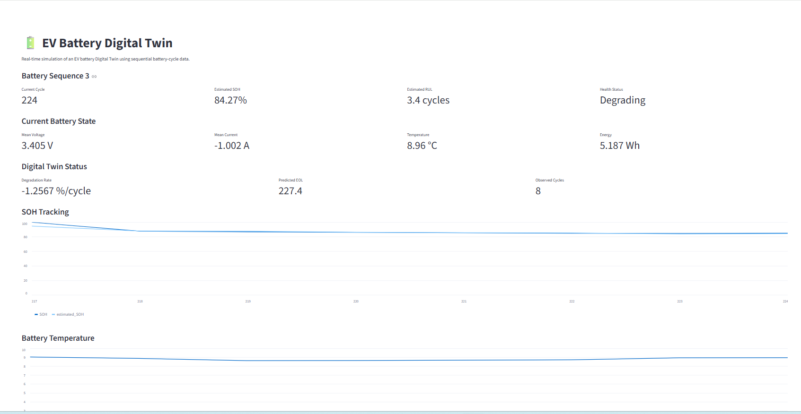

# 🔋 EV Battery Digital Twin

### Data-Driven Battery SOH Estimation • Degradation Tracking • RUL Prediction

<p align="center">
  
</p>

<p align="center">
  
  
  
  
</p>

# 🔋 EV Battery Digital Twin

## Data-Driven EV Battery SOH Monitoring, Degradation Tracking and RUL Prediction

A data-driven, sequential Digital Twin prototype for EV battery health monitoring using recorded battery-cycle data.

The project combines cycle-level feature engineering, Extra Trees based State of Health (SOH) estimation, sequential Digital Twin updating, degradation tracking, End-of-Life (EOL) estimation, Remaining Useful Life (RUL) prediction, and a Streamlit dashboard.

> **Current scope:** The project uses historical battery-cycle data replayed sequentially. It is not currently connected to a live BMS, CAN network, or physical EV battery.

---

# 1. Project Overview & Objectives

Battery degradation is an important challenge in Electric Vehicles because battery characteristics change as the battery is repeatedly operated.

This project develops a software-based Digital Twin framework that uses measured battery-cycle characteristics to estimate and track battery health.

The core workflow is:

```text
Battery Cycle Data
        ↓
Feature Engineering
        ↓
Extra Trees SOH Estimation
        ↓
Digital Twin State Update
        ↓
Degradation Estimation
        ↓
EOL Prediction
        ↓
RUL Estimation
        ↓
Streamlit Dashboard
```

### Objectives

- Process battery-cycle data into a structured dataset.
- Extract voltage, current, and temperature features.
- Estimate battery SOH using machine learning.
- Maintain a sequential Digital Twin history.
- Estimate the recent battery degradation rate.
- Predict EOL using an 80% SOH threshold.
- Estimate RUL in remaining battery cycles.
- Provide an interactive battery-health dashboard.
- Establish a foundation for future BMS/CAN and hardware integration.

The important distinction in the architecture is:

```text
Extra Trees  → SOH estimation
Digital Twin → Sequential battery-state representation
Streamlit    → Visualization / monitoring
```

---

# 2. System Architecture & Methodology

The overall architecture is:

```text
                    BATTERY-CYCLE DATA
                           │
                           ▼
                ┌─────────────────────┐
                │ Feature Engineering │
                │                     │
                │ Voltage             │
                │ Current             │
                │ Temperature         │
                └──────────┬──────────┘
                           │
                           ▼
                ┌─────────────────────┐
                │ Extra Trees Model   │
                │                     │
                │ SOH Estimation      │
                └──────────┬──────────┘
                           │
                           ▼
                ┌─────────────────────┐
                │    DIGITAL TWIN     │
                │                     │
                │ SOH History         │
                │ Degradation         │
                │ EOL                 │
                │ RUL                 │
                │ Health Status       │
                └──────────┬──────────┘
                           │
                           ▼
                ┌─────────────────────┐
                │ Streamlit Dashboard │
                └─────────────────────┘
```

For every new cycle, the Digital Twin performs:

1. Extract the model features.
2. Predict SOH using Extra Trees.
3. Add estimated SOH to the history.
4. Select recent SOH observations.
5. Estimate the degradation rate using Linear Regression.
6. Estimate EOL if the degradation rate is negative.
7. Calculate RUL.
8. Determine battery-health status.
9. Pass the updated history to the next cycle.

This sequential update is the main Digital Twin behavior of the project.

---

# 3. Dataset & Feature Engineering

The processed dataset contains:

```text
408 samples
19 columns
5 battery sequences
```

Sequence sizes:

| Sequence | Samples |
|---|---:|
| 1 | 138 |
| 2 | 69 |
| 3 | 69 |
| 4 | 25 |
| 5 | 107 |

Sequence 5 contains:

```text
107 observations
Cycle range: 453–714
```

The processed dataset is stored in:

```text
data/ml_dataset.csv
```

### Dataset Information

The dataset contains:

```text
sequence_id
cycle

voltage_mean
voltage_std
voltage_min
voltage_max
voltage_range

current_mean
current_std
current_min
current_max

temperature_mean
temperature_std
temperature_max
temperature_rise

duration_s
energy_Wh

SOH
local_cycle
```

### Model Features

Although the dataset contains 19 columns, the final Extra Trees model uses exactly 13 features:

```text
voltage_mean
voltage_std
voltage_min
voltage_max
voltage_range

current_mean
current_std
current_min
current_max

temperature_mean
temperature_std
temperature_max
temperature_rise
```

### Feature Meaning

**Voltage features** describe the average level, variation, and range of voltage behavior.

**Current features** describe average current, current variation, and current limits.

**Temperature features** describe average thermal behavior, variation, peak temperature, and temperature rise.

The exact feature order is stored in:

```text
models/feature_columns.pkl
```

---

# 4. SOH Estimation & Digital Twin Formulation

## SOH Estimation

SOH is treated as a continuous regression target.

For a cycle `k`, the model input is:

```text
x_k ∈ R^13
```

and the Extra Trees model produces:

```text
SOH_hat(k) = f_ET(x_k)
```

The prediction is constrained to:

```text
0 ≤ SOH_hat(k) ≤ 100
```

The trained model is stored in:

```text
models/extra_trees_model.pkl
```

### Why Extra Trees?

Extra Trees is an ensemble of randomized decision trees. It is suitable for the current tabular battery feature representation because it can model nonlinear relationships between voltage/current/temperature characteristics and SOH.

---

## Digital Twin State

The Digital Twin state for a cycle contains:

```text
cycle
estimated_SOH
degradation_rate
predicted_EOL_cycle
RUL
health_status
history
```

The history is important because battery degradation is analyzed from recent SOH estimates rather than from an isolated prediction.

---

## Sequential Update

The current implementation initializes Sequence 5 using the first:

```text
40 observations
```

The Extra Trees model generates SOH estimates for this initial history.

The remaining:

```text
67 observations
```

are then processed one by one.

Conceptually:

```text
Initial History
      ↓
Next Cycle
      ↓
SOH Prediction
      ↓
Update History
      ↓
Degradation
      ↓
EOL / RUL
      ↓
Next Cycle
      ↓
Repeat
```

This creates a sequential/offline Digital Twin simulation.

---

# 5. Degradation, EOL & RUL

The Digital Twin estimates the recent degradation rate using Linear Regression.

For the latest observations:

```text
SOH_hat = a × cycle + b
```

where:

- `a` = degradation rate
- `b` = regression intercept

The main sequential update uses a:

```text
trend_window = 20
```

Therefore, the degradation estimate represents the recent SOH trend rather than the entire battery history.

For a degrading battery:

```text
a < 0
```

## EOL

The project defines:

```text
EOL threshold = 80% SOH
```

Using the local linear degradation model:

```text
80 =
SOH_current + a × Δcycle
```

Therefore:

```text
Δcycle =
(SOH_current - 80) / |a|
```

and:

```text
Predicted EOL =
Current Cycle + Δcycle
```

The EOL calculation is performed only when the degradation rate is finite and negative and the current SOH is above the threshold.

## RUL

The remaining useful life is:

```text
RUL =
max(0, Predicted EOL - Current Cycle)
```

RUL is therefore expressed as:

```text
remaining battery cycles
```

## Health Classification

The current thresholds are:

```text
SOH ≥ 90%        → Healthy
80% ≤ SOH < 90%  → Degrading
SOH < 80%        → Severely degraded
```

The 80% value is a project-defined EOL criterion, not a universal battery standard.

---

# 6. Validation & Results

Several validation strategies were used because battery-cycle observations can be correlated.

## Standard Extra Trees Evaluation

| Metric | Result |
|---|---:|
| MAE | 2.730% |
| RMSE | 3.493% |
| R² | 0.954 |

## Leave-One-Sequence-Out Validation

| Test Sequence | MAE (%) | RMSE (%) | R² |
|---|---:|---:|---:|
| Sequence 1 | 16.918 | 18.921 | -0.686 |
| Sequence 2 | 10.293 | 10.724 | -2.251 |
| Sequence 3 | 4.462 | 5.370 | 0.303 |
| Sequence 4 | 7.586 | 7.628 | -1.171 |
| Sequence 5 | 8.867 | 11.073 | -1.930 |
| **Average** | **9.625** | **10.743** | **-1.147** |

## Temporal Validation — Sequence 5

Training:

```text
Cycles 453–594
```

Testing:

```text
Cycles 595–714
```

Results:

| Metric | Result |
|---|---:|
| MAE | 11.640% |
| RMSE | 13.028% |
| R² | -3.048 |

## Sequential Digital Twin Evaluation

The Digital Twin uses:

```text
40 initial observations
67 sequential observations
```

Results:

| Metric | Result |
|---|---:|
| MAE | 0.552% |
| RMSE | 0.758% |
| R² | 0.990 |

### Interpretation

The results show why validation strategy matters.

The standard evaluation produces strong results, while LOSO and temporal validation are substantially harder. This indicates that generalization to unseen sequences and future battery behavior remains a challenge.

The sequential Digital Twin result should therefore be reported specifically as the result of the evaluated Sequence 5 setup and **not** as proof of unbiased generalization to completely unseen batteries.

---

# 7. Streamlit Dashboard

The project includes an interactive Streamlit dashboard for exploring the battery-cycle Digital Twin.


The dashboard loads:

```text
data/ml_dataset.csv
models/extra_trees_model.pkl
models/feature_columns.pkl
```

and provides sequential battery-cycle visualization.

### Dashboard Features

- Battery sequence selection
- Previous/next cycle navigation
- Reset functionality
- Current cycle
- Estimated SOH
- Battery health status
- Degradation rate
- Predicted EOL
- Estimated RUL
- Voltage information
- Current information
- Temperature information
- Energy information
- SOH trend visualization
- Temperature trend visualization
- Voltage/current plots

The dashboard is the **visualization layer**. The Digital Twin logic is implemented in the project workflow and its sequential state/history.

### Run Dashboard

From the repository root:

```bash
pip install -r requirements.txt
streamlit run dashboard/app.py
```

---

# 8. Repository Structure & Reproduction

```text
EV-Battery-Digital-Twin/
│
├── README.md
├── requirements.txt
├── .gitignore
│
├── dashboard/
│   └── app.py
│
├── data/
│   ├── ml_dataset.csv
│   └── README.md
│
├── images/
│   └── dashboard.png
│
├── models/
│   ├── extra_trees_model.pkl
│   └── feature_columns.pkl
│
├── notebooks/
│   └── EV_Battery_Digital_Twin.ipynb
│
└── results/
    ├── digital_twin_history.csv
    └── rul_summary.csv
```

### Important Files

| File | Purpose |
|---|---|
| `ml_dataset.csv` | Processed battery-cycle dataset |
| `extra_trees_model.pkl` | Trained SOH estimator |
| `feature_columns.pkl` | Exact model feature configuration |
| `EV_Battery_Digital_Twin.ipynb` | Main Digital Twin workflow |
| `digital_twin_history.csv` | Sequential Digital Twin results |
| `rul_summary.csv` | RUL results |
| `dashboard/app.py` | Streamlit dashboard |
| `requirements.txt` | Python dependencies |

### Reproduction Workflow

```text
Load Dataset
     ↓
Load Extra Trees Model
     ↓
Load Feature Configuration
     ↓
Select Sequence 5
     ↓
Create 40-sample Initial History
     ↓
Estimate Initial SOH
     ↓
Process Remaining 67 Cycles Sequentially
     ↓
Update Digital Twin
     ↓
Estimate Degradation
     ↓
Estimate EOL
     ↓
Estimate RUL
     ↓
Evaluate Results
     ↓
Save Output Files
```

---

# 9. Limitations & Future Work

## Current Limitations

The current implementation:

- uses recorded historical data,
- is not connected to a physical battery,
- has no live BMS interface,
- has no CAN communication,
- has no hardware-in-the-loop validation,
- uses a relatively small processed dataset,
- uses a simple local linear degradation model,
- provides point-estimate RUL rather than uncertainty-aware RUL,
- has limited generalization across unseen sequences.

The validation experiments demonstrate that unseen-sequence and future-cycle prediction remain challenging.

## Future Architecture

The long-term architecture is:

```text
Physical EV Battery
        ↓
BMS Sensors
        ↓
CAN / UART
        ↓
Data Acquisition
        ↓
Feature Extraction
        ↓
SOH Estimator
        ↓
Online Digital Twin
        ↓
Degradation / EOL / RUL
        ↓
Real-Time Dashboard
```

## Future Work

- Live BMS integration
- CAN communication
- Online Digital Twin updates
- Multi-battery validation
- Improved degradation modeling
- Uncertainty-aware RUL prediction
- Hardware-in-the-loop validation
- Embedded deployment
- Real-time monitoring

---

# 10. Technologies, Automotive Relevance & Author

## Technologies

- **Python** — Main implementation
- **NumPy** — Numerical computation
- **Pandas** — Data processing
- **Scikit-learn** — Machine learning
- **Extra Trees** — SOH estimation
- **Linear Regression** — Degradation estimation
- **Joblib** — Model serialization
- **Streamlit** — Dashboard
- **Jupyter / Google Colab** — Development
- **Git / GitHub** — Version control

## Automotive / EV Relevance

The project demonstrates concepts relevant to:

- EV battery health monitoring
- Battery Management Systems
- SOH estimation
- Predictive maintenance
- RUL prediction
- Automotive CAN integration
- Embedded battery systems
- Cyber-Physical Systems
- Digital Twin development

The current system provides the software foundation for a future real-time battery Digital Twin connected to a BMS.

## Project Status

### Completed

- [x] Battery-cycle data processing
- [x] Feature engineering
- [x] Extra Trees SOH estimation
- [x] Digital Twin state update
- [x] Sequential simulation
- [x] Degradation estimation
- [x] EOL estimation
- [x] RUL estimation
- [x] Streamlit dashboard
- [x] Validation experiments
- [x] GitHub project structure

### Planned

- [ ] Live BMS
- [ ] CAN integration
- [ ] Online Digital Twin
- [ ] Hardware validation
- [ ] Multi-battery validation
- [ ] Improved RUL
- [ ] Embedded deployment

---

## Author

**Ketan Bathla**  
M.Tech — Cyber-Physical Systems  
Indian Institute of Technology Jodhpur

> **EV Battery Digital Twin — From battery-cycle data to SOH estimation, degradation tracking and RUL prediction.**
